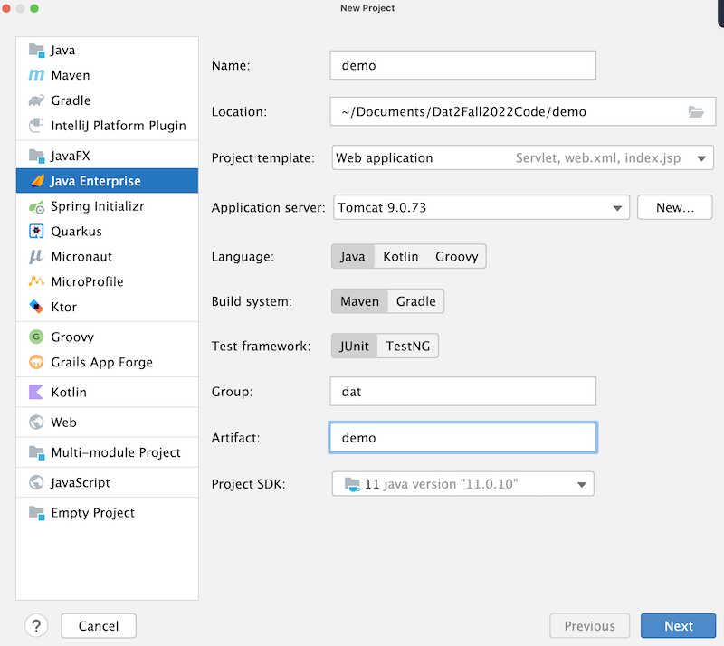

#Dokumentation
Dette er min egen dokumentation af Java Webstack.
Vi skal lave et internet og vil burge denne
dokumentation, til at bedre kunne huske hvad vi lavede.
- 06-03-2023
## Start af et nyt webprojekt
1. Opet nyt projekt i IntlliJ 2021.3
2. Java + Maven
3. Servlet Depdincies
4. Vælg Java EE projektskabelon
5. Opsæt Tomcat i run.

6. Tjek om tomcat kører i "Tjenester", i tilfælde af at prorammet ikke kører.

## Arkitektur
Vi anvender en slags MVC-pattern.


####MVC
- M(odel) - Entiteter, hjælpe-metoder og klasser. Business-logic
- V(iew) - JSP og frontend (css, bootstrap mm.)
- C(ontrol) - Servlets (tjenere)

Husk! View og model må ikke tale sammen, medmindre det er via controlleren.
 
## Opret Git repo
Find først din mappe i din stifinder, og højreklik på den ved at åbne den med "Git Bash Here"
```shell
git init
git add .
git commit -m "first commit"
git remote add origin https://github.com/Kussemar/intranet.git
git push -u origin main
genindlæs side :-)
```